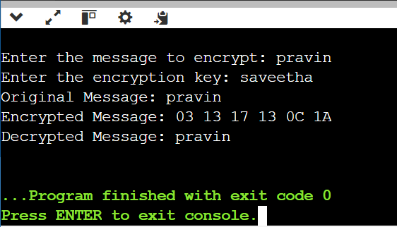

# EX-4-ADVANCED-ENCRYPTION-STANDARD-DES-ALGORITHM

## Aim:
  To use Advanced Encryption Standard (AES) Algorithm for a practical application like URL Encryption.

## ALGORITHM: 
  1. AES is based on a design principle known as a substitution–permutation. 
  2. AES does not use a Feistel network like DES, it uses variant of Rijndael. 
  3. It has a fixed block size of 128 bits, and a key size of 128, 192, or 256 bits. 
  4. AES operates on a 4 × 4 column-major order array of bytes, termed the state

## PROGRAM: 
~~~
#include <stdio.h>
#include <string.h>

// Function to perform a simple XOR-based encryption
void encrypt(char *message, char *key, char *encryptedMessage, int messageLength) {
    int keyLength = strlen(key);

    for (int i = 0; i < messageLength; i++) {
        // Encrypt by XORing message byte with key byte
        encryptedMessage[i] = message[i] ^ key[i % keyLength];
    }
    encryptedMessage[messageLength] = '\0';  // Null-terminate the encrypted message
}

// Function to perform decryption (XOR again with the same key)
void decrypt(char *encryptedMessage, char *key, char *decryptedMessage, int messageLength) {
    int keyLength = strlen(key);

    for (int i = 0; i < messageLength; i++) {
        // Decrypt by XORing encrypted byte with key byte
        decryptedMessage[i] = encryptedMessage[i] ^ key[i % keyLength];
    }
    decryptedMessage[messageLength] = '\0';  // Null-terminate the decrypted message
}

int main() {
    char message[100];
    char key[100];
    
    printf("\n      *****Simulation of DES encryption and decryption*****\n\n");
    // Get user input for the message
    printf("Enter the message to encrypt: ");
    fgets(message, sizeof(message), stdin);
    message[strcspn(message, "\n")] = '\0';  // Remove newline character if present

    // Get user input for the key
    printf("Enter the encryption key: ");
    fgets(key, sizeof(key), stdin);
    key[strcspn(key, "\n")] = '\0';  // Remove newline character if present

    int messageLength = strlen(message);
    
    // Buffers to hold encrypted and decrypted messages
    char encryptedMessage[100];
    char decryptedMessage[100];
    
    // Encrypt the message
    encrypt(message, key, encryptedMessage, messageLength);
    printf("Original Message: %s\n", message);
    printf("Encrypted Message: ");
    
    // Print encrypted message in hex format
    for (int i = 0; i < messageLength; i++) {
        printf("%02X ", (unsigned char)encryptedMessage[i]);
    }
    printf("\n");
    
    // Decrypt the message
    decrypt(encryptedMessage, key, decryptedMessage, messageLength);
    printf("Decrypted Message: %s\n", decryptedMessage);
    
    return 0;
}

~~~
## OUTPUT:

## RESULT: 
Hence, for the given input text and key the DES algorithm is successfully simulated.
